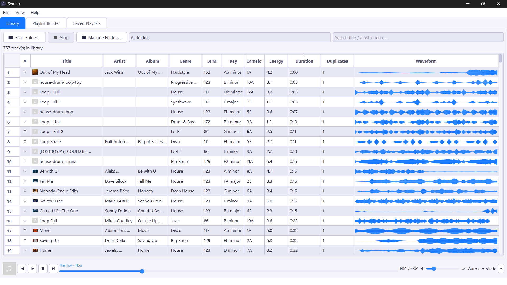
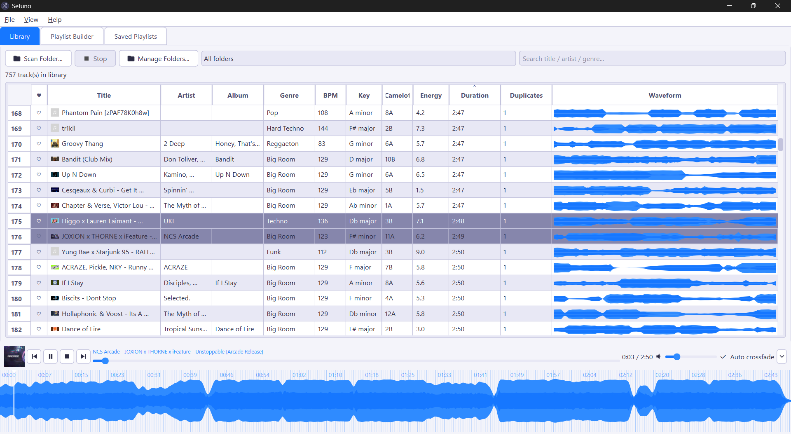
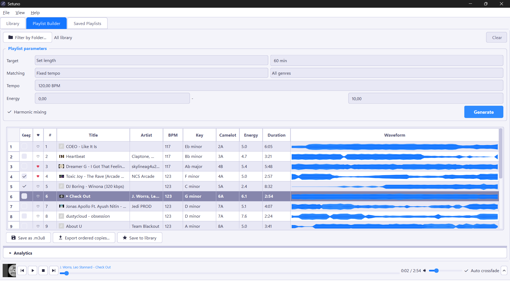
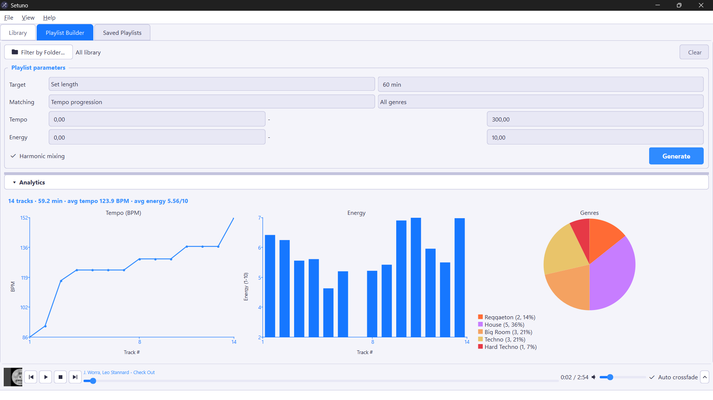
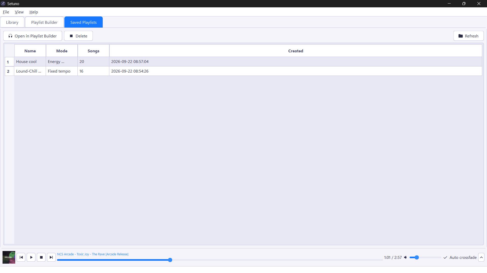
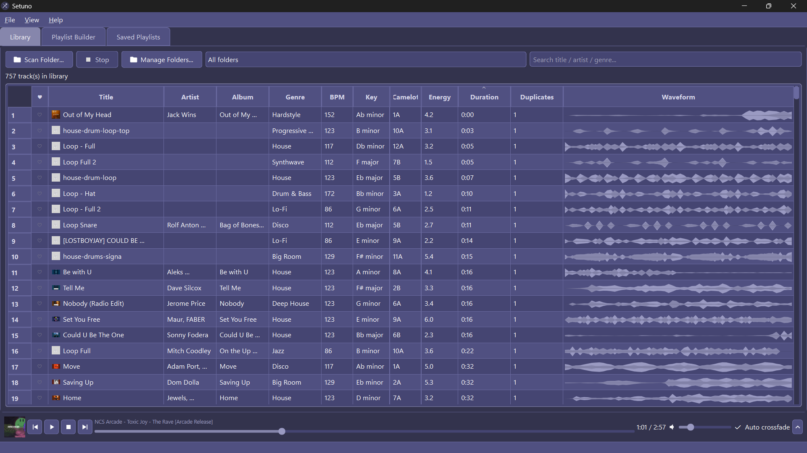
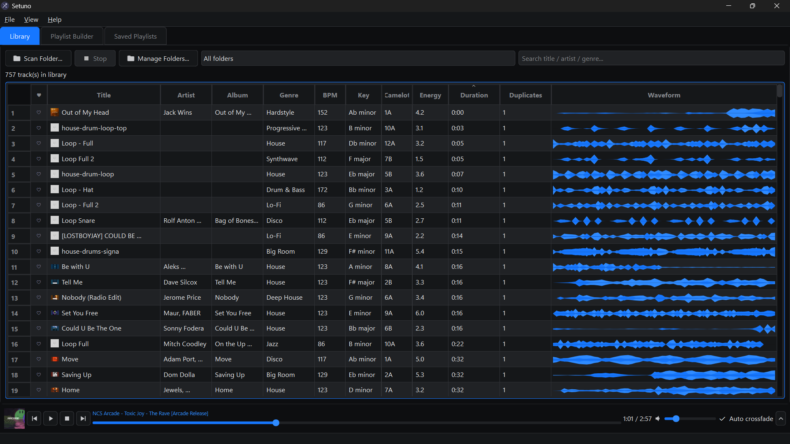

<div align="center">
  

  # Setuno

  **A local, offline companion for DJs, radio hosts, and playlist curators.**

  [](https://github.com/jbaudru/Setuno/releases/latest)
</div>

Setuno scans a music folder (recursively), analyzes each track's **tempo (BPM)**, **musical
key** (with Camelot wheel code for harmonic mixing), **energy**, and **genre**, then generates
ordered playlists for a target set length or track count, with an embedded player, waveform
view, live statistics, and export options. Everything runs locally and offline; your library
never leaves your machine.

Created by **J. Baudru (Bonoob)**.

## Download

Prebuilt, ready-to-run builds are published on the [Releases page](https://github.com/jbaudru/Setuno/releases/latest):

| Platform | Download | Notes |
| --- | --- | --- |
| Windows | `Setuno-Setup-<version>.exe` | Installer (Start Menu + desktop shortcut) |
| Windows | `Setuno.exe` | Portable, no installation needed |
| macOS | `Setuno.dmg` | Open it and drag **Setuno** into **Applications** |

No Python installation is required to use these builds. If your platform isn't listed, or you'd
rather run the source directly, see [Running from source](#running-from-source) below.

## Screenshots

### Library

Browse the analyzed library, search/filter folders, spot duplicates, and open compact waveforms.



### Extended Library

Use the embedded player and expanded waveform while browsing your tracks.



### Playlist Builder

Generate a set by duration or track count, then fine-tune filters, order, and output options.



### Playlist Analytics

Inspect tempo and energy curves, genre distribution, and playlist totals.



### Saved Playlists

Reopen or remove saved playlist definitions from the library.



### Themes

Choose from Setuno's dark presentation or the Rekordbox-inspired color scheme.





## Features

- Recursive folder scan (`mp3`, `wav`, `flac`, `ogg`), analyzed in parallel with a thread pool
- Automatic metadata: tempo, key (Camelot code), energy (1-10 normalized), and genre, classified
  across 35+ styles from spectral/rhythmic descriptors, with `librosa`-backed tempo/key detection
  when that optional dependency is installed
- Tracks appear in the library live as each one finishes analyzing (no waiting for the full scan)
- Favorites (heart a track) that are also weighted more likely to appear in generated playlists
- Playlist generation modes:
  - **Fixed tempo**: consistent tempo band, ordered for harmonic (Camelot) compatibility
  - **Tempo progression**: build up (or down) tempo across the set
  - **Fixed energy**: consistent energy band
  - **Energy progression**: energy build across the set
  - **Tempo + Energy progression**: combined build across the set
- "Keep" checkboxes in the Playlist Builder to pin favorite tracks and regenerate the rest of
  the set around them
- Target set length (30 min, 1h, 2h, ...) or a fixed track count, with duration-aware selection
- Filter by genre / tempo range / energy range
- Embedded audio player with click-to-seek and an extendable waveform view showing live playback
  progress, plus optional tempo-matched auto-crossfade into the next visible track
- Per-track waveform viewer with zoom/pan, BPM grid, and independent preview playback (seek and
  play a section without disturbing the main player)
- Full metadata editor (title/artist/album/genre/cover art) from the Library or Playlist Builder
- Live stats: tempo curve, energy curve, genre breakdown, totals: themed to match the active
  color scheme
- Export: save as `.m3u` / `.m3u8` (importable in Rekordbox and similar DJ software, with tags
  synced on exported copies), copy files in playlist order into a folder with numeric prefixes
  (`01 - Artist - Title.mp3`, ...), or save the playlist definition to the library
- Remove tracks from the library without touching the files on disk
- Duplicate detection for tracks with matching artist and title, including alternate file formats/bitrates
- Multiple themes (dark, light, Rekordbox-style)
- Local JSON library cache (no external database); re-scanning only re-analyzes new/changed files

## Running from source

If you're not using one of the compiled builds above, Setuno runs anywhere Python 3.11+ and Qt
are supported (Windows, macOS, Linux).

```bash
git clone https://github.com/jbaudru/Setuno.git
cd Setuno
python -m venv .venv

# Windows
.venv\Scripts\Activate.ps1
# macOS / Linux
source .venv/bin/activate

pip install -r requirements.txt
python main.py
```

### Dependencies

Kept intentionally minimal for a small, portable build:

- `PySide6`: UI, embedded player (QtMultimedia)
- `numpy`: tempo/key/energy DSP (STFT, onset detection, autocorrelation, chroma)
- `miniaudio`: lightweight audio decoding (mp3/wav/flac/ogg)
- `mutagen`: reading and writing tags/cover art
- `librosa` *(optional)*: improves tempo and key detection accuracy when installed; Setuno
  automatically falls back to its built-in numpy-only detector if it isn't present

## Building the binaries yourself

Both the Windows `.exe`/installer and the macOS `.app`/`.dmg` are produced from the same
[`build.spec`](build.spec) PyInstaller spec, and are built automatically by the
[`release` GitHub Actions workflow](.github/workflows/release.yml) whenever a `v*` tag is pushed
(see the **Actions** tab for build artifacts, or the **Releases** page once published).

To build locally instead:

### Windows

```powershell
pip install pyinstaller
python -m PyInstaller --noconfirm build.spec
# -> dist\Setuno.exe (portable, single file)
```

`dist\Setuno.exe` is kept for release publishing; other transient build files remain ignored.

Optionally wrap it in a proper installer with [Inno Setup](https://jrsoftware.org/isinfo.php):

```powershell
ISCC installer\setuno.iss
# -> dist\installer\Setuno-Setup-<version>.exe
```

### macOS

```bash
pip install pyinstaller
bash scripts/make_icns.sh   # generates assets/icon.icns from icon.png (macOS only)
pyinstaller build.spec
# -> dist/Setuno.app
```

Package it as a `.dmg` for distribution:

```bash
hdiutil create -volname "Setuno" -srcfolder dist/Setuno.app -ov -format UDZO dist/Setuno.dmg
```

## Notes

- The library is stored as plain JSON files under `data/library.json` and `data/playlists.json`,
  next to `main.py` (or next to the app executable when built). No external database.
- Analysis of long tracks is capped to a ~90s representative window for speed; this keeps
  scanning fast while still giving reliable tempo/key/energy estimates.
- Genre is read from existing ID3/Vorbis tags when present; otherwise it's classified by a
  nearest-profile match over BPM and spectral/rhythmic descriptors (see `GENRE_PROFILES` in
  `playlistbro/core/analyzer.py`).

## Roadmap — ideas for later

Useful DJ/radio/curator features not yet implemented, kept here as a backlog:

- **Cue points & hot cues** — save/recall intro, drop, and outro markers per track.
- **Vocal/instrumental detection** — tag tracks as vocal, instrumental, or acapella for smarter mixing.
- **Streaming service import** — import a Spotify/SoundCloud/Bandcamp playlist as a reference to match against the local library.
- **Confidence score** — show a confidence indicator alongside auto-detected BPM/key for low-certainty tracks.
- **Multiple output profiles** — export presets per target software (Rekordbox, Serato, Traktor, generic M3U) with their specific quirks/metadata.

